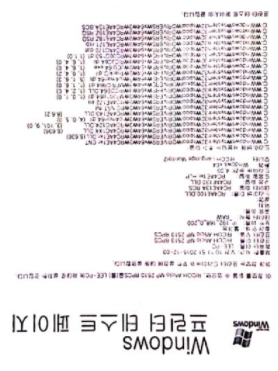

# 거꾸로 스캔된 문서를 자동회전하는 머신만들기

  

## 프로젝트의 소개

스캔을 하다보면 스캔의 기준점을 인지하기 어려워 문서를 거꾸로 스캔하는 경우가 많이 있을 것 입니다.  

이러한 문서를 자동으로 회전시키는 기술을 궁극적으로 개발하고자 합니다.  

### 요구조건 : Mission

이를 위해선 "글자가 거꾸로 스캔이 되었는지를 판단하는 인식기" 개발이 선행되어야 하며, 머신러닝과 인공지능 기술을 이용해 구현해 보고  
이를 문서 전체에 확산시켜 문서가 거꾸로 스캔된 것인지를 판단하는 인식기로 개념을 확장시킬 것입니다.  

  

## 현재 상태

필요 배경지식 습득중

### 필요 배경지식

* [OCR (Optical character recognition)](https://ko.wikipedia.org/wiki/%EA%B4%91%ED%95%99_%EB%AC%B8%EC%9E%90_%EC%9D%B8%EC%8B%9D)

  

## 동작환경

[R](https://www.r-project.org/) (>= 3.4.0)

  

## License

[GPL-3](https://www.gnu.org/licenses/gpl-3.0.en.html)
